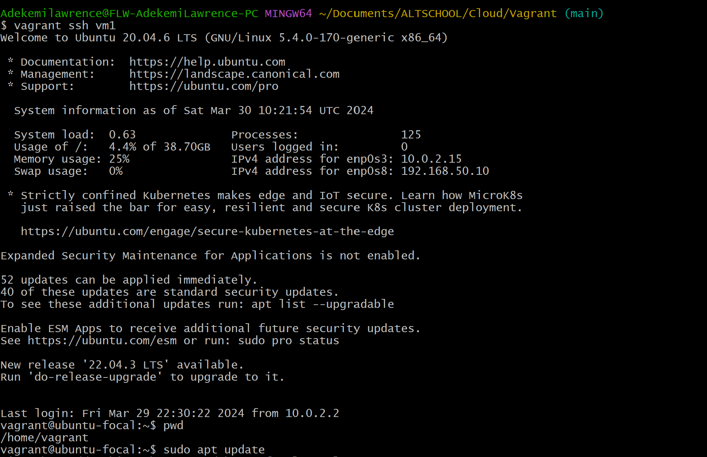
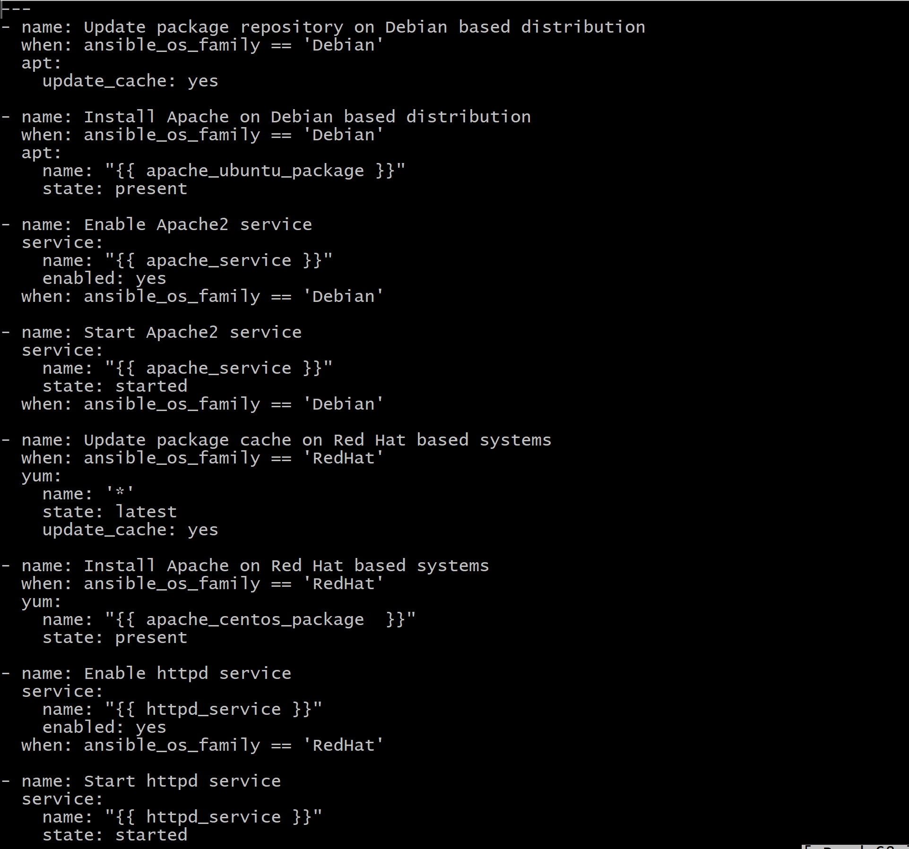
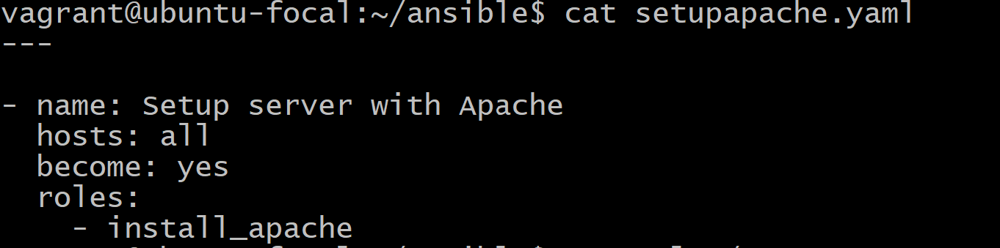
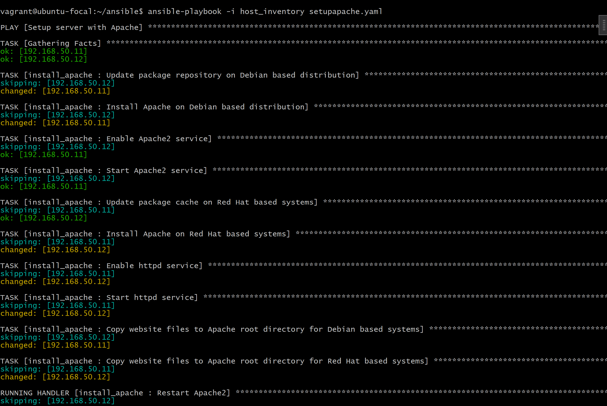

# Deployed an open source app on GitHub using Ansible

## Step 1
### Encountered a network issue which is caused my ip address conflict and I had to change ip address and allocate different ip addresses for my master and other two slave servers.

## Step 2
### vagrant up, after all my machines were successfully running, I had to vagrant ssh into my master server (vm1)

## Step 3
### after ssh into master server, I had to vagrant ssh into my two other nodes/slave servers vm2 which Ubuntu flavor and vm3 which is CentOS with the various ip address. I created a test filed in master upon ssh into each slave server to confirm if they are in sync.

## Step 4
### On my master server, I created a folder called ansible and test file when I vagrant@ with my ip addresses of vm2 and vm3 to show it connected to my master

## Step 5
### On my master server, cd ansible and created two directories (host_inventory where I added my vm2 and vm3 web servers in it using nano command) and a file called roles.

## Step 6
### On my master server, cd roles and have a folder called install_apached where I created four files which embodied tasks, handles, vars, and a clone repo from my github.

## Step 7
### On my master server, cd tasks then created a main.yaml file where I have my instruction of basic tasks I need it to run such as install apache2 if ansible_os_family is Debian or install httpd_service if ansible_os_family is Redhat.

## Step 8
### On my master server, cd handlers then created a main.yaml file where I have my instruction similar to tasks but I want it to `restart apache2 if ansible_os_family is Debian or start httpd_service if ansible_os_family is Redhat.

## Step 9
### On my master server, `cd vars` which displays the packages installed for each ansible_os_family which is Apache2 for Debian and httpd_service for Redhat.

## Step 10
### On my master server, `cd setupapache.yaml` which shows the instruction of setting up the Apache serevr.

## Step 11
### On my master server, `cd ansible` directory, I had to check if my ansible playbook is running with no error or failure rate using the `ansible-playbook -i host_inventory setupapache.yaml` command to check.
